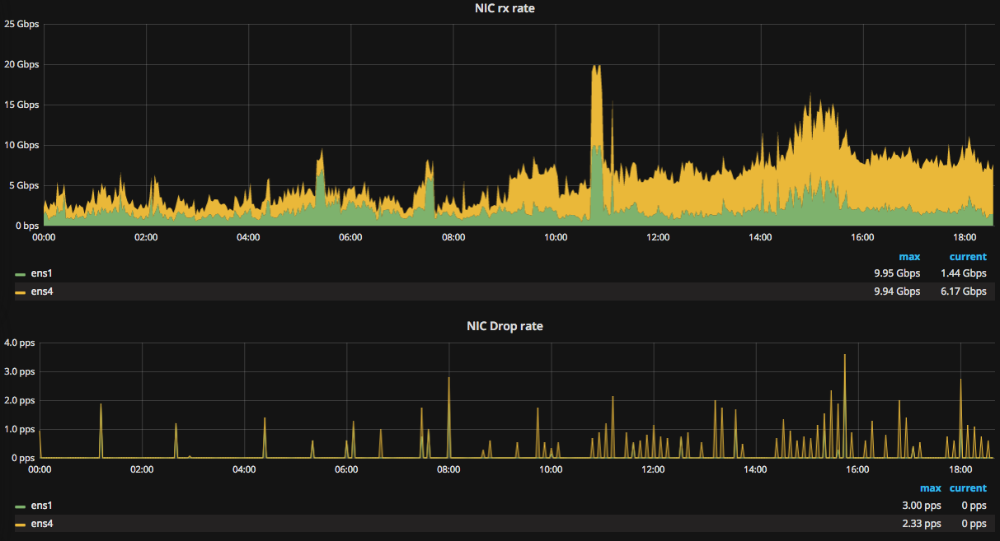

# GOTM

gotm is a full packet capture application like
[time-machine](https://www.bro.org/community/time-machine.html) or
[stenographer](https://github.com/google/stenographer).  Like timemachine it cuts off flows
after a configurable byte/packet count.

Most people probably want to use stenographer.  If AFPacket was not broken on RHEL/Centos I would add flow-cutoff to stenographer and use that.

## gotm features

### Simple

gotm is under 500 lines of code with 1/3 of that related to metrics.  There's only maybe 25 lines of code that have anything to do with packets.

### Standard output format with optional gzip compression

gotm outputs files in standard pcap format.  pcaps can be compressed on the fly.  We started doing that but switched to ZFS compression.

### Flow cutoff

gotm can cutoff flows at a configurable packet or byte boundary.
With a flow cutoff of 64k we still capture full flows for 99.8% of connections.
The other 0.2% of connections account for 99% of the traffic.

### Supports capture methods other than AFPacket

AFPacket is great, but still broken on many linux distributions.  I am using gotm with the myricom SNF libpcap, but it should also work with pf_ring with a small code change.  gotm would also work with AFPacket, but I don't have a machine to test it on.

### Extensive prometheus metrics

gotm is instrumented using prometheus. [a grafana dashboard](./deploy/grafana_dashboard.json) is provided and can be used to visualize the status of the server.  Metrics include packet and byte counts, nic counters, active flow counts, output byte counts, and flow sizes.

### Good performance

In our environment it can handle a full 10-20gbit of traffic on a single box without dropped packets.  This is real world "science DMZ" type traffic.

## gotm non-Features

### packet indexing

Stenographer and time-machine index packets to enable faster searching.

gotm does not index anything, howevever [flow-indexer](https://github.com/JustinAzoff/flow-indexer) supports pcap files and can be used to search gotm output files for a particular address.

I'm currently working on some analyst tools that integrate gotm and flow-indexer.

Even without indexing, tcpdump can read through the last hours worth of our pcaps in about 8 seconds.

## Running gotm in production

See [deploy](./deploy)

## What does it look like?

```
$ ./gotm -rotationinterval 60s -interface en0 -compress
2017/08/29 17:45:58 Starting capture on en0 with 1 workers
2017/08/29 17:45:58 Opening new pcap file en0_current.pcap.tmp.gz
2017/08/29 17:45:58 Starting worker 0 on interface en0
2017/08/29 17:46:58 Rotating
2017/08/29 17:46:58 moved en0_current.pcap.tmp.gz to out/2017/08/29/2017-08-29T17-46-58.pcap.gz
2017/08/29 17:46:58 Opening new pcap file en0_current.pcap.tmp.gz
2017/08/29 17:47:07 if=en0 W=00 flows=35 removed=183 bytes=2206834 pkts=5000 output=2346 outpct=46.9 recvd=5268 dropped=0 ifdropped=0
2017/08/29 17:47:37 if=en0 W=00 flows=68 removed=67 bytes=3607893 pkts=5000 output=1121 outpct=22.4 recvd=10425 dropped=0 ifdropped=0
2017/08/29 17:47:58 Rotating
2017/08/29 17:47:58 moved en0_current.pcap.tmp.gz to out/2017/08/29/2017-08-29T17-47-58.pcap.gz
2017/08/29 17:47:58 Opening new pcap file en0_current.pcap.tmp.gz
2017/08/29 17:48:58 Rotating
2017/08/29 17:48:58 moved en0_current.pcap.tmp.gz to out/2017/08/29/2017-08-29T17-48-58.pcap.gz
2017/08/29 17:48:58 Opening new pcap file en0_current.pcap.tmp.gz
2017/08/29 17:49:17 if=en0 W=00 flows=32 removed=169 bytes=2320686 pkts=5000 output=813 outpct=16.3 recvd=15777 dropped=0 ifdropped=0
2017/08/29 17:49:58 Rotating
2017/08/29 17:49:58 moved en0_current.pcap.tmp.gz to out/2017/08/29/2017-08-29T17-49-58.pcap.gz
2017/08/29 17:49:58 Opening new pcap file en0_current.pcap.tmp.gz
2017/08/29 17:50:10 if=en0 W=00 flows=19 removed=153 bytes=2538996 pkts=5000 output=704 outpct=14.1 recvd=25974 dropped=0 ifdropped=0
2017/08/29 17:50:58 Rotating
2017/08/29 17:50:58 moved en0_current.pcap.tmp.gz to out/2017/08/29/2017-08-29T17-50-58.pcap.gz
2017/08/29 17:50:58 Opening new pcap file en0_current.pcap.tmp.gz
2017/08/29 17:51:15 if=en0 W=00 flows=30 removed=90 bytes=2285146 pkts=5000 output=545 outpct=10.9 recvd=31232 dropped=0 ifdropped=0
2017/08/29 17:51:58 Rotating
2017/08/29 17:51:58 moved en0_current.pcap.tmp.gz to out/2017/08/29/2017-08-29T17-51-58.pcap.gz
2017/08/29 17:51:58 Opening new pcap file en0_current.pcap.tmp.gz
2017/08/29 17:52:17 if=en0 W=00 flows=29 removed=105 bytes=2225439 pkts=5000 output=512 outpct=10.2 recvd=36464 dropped=0 ifdropped=0
2017/08/29 17:52:58 Rotating
2017/08/29 17:52:58 moved en0_current.pcap.tmp.gz to out/2017/08/29/2017-08-29T17-52-58.pcap.gz
2017/08/29 17:52:58 Opening new pcap file en0_current.pcap.tmp.gz
2017/08/29 17:53:21 if=en0 W=00 flows=30 removed=89 bytes=2298240 pkts=5000 output=435 outpct=8.7 recvd=41709 dropped=0 ifdropped=0
2017/08/29 17:53:27 if=en0 W=00 flows=36 removed=18 bytes=3681741 pkts=5000 output=60 outpct=1.2 recvd=46753 dropped=0 ifdropped=0
2017/08/29 17:53:34 if=en0 W=00 flows=28 removed=24 bytes=3641399 pkts=5000 output=32 outpct=0.6 recvd=56789 dropped=0 ifdropped=0
2017/08/29 17:53:58 Rotating
2017/08/29 17:53:58 moved en0_current.pcap.tmp.gz to out/2017/08/29/2017-08-29T17-53-58.pcap.gz
2017/08/29 17:53:58 Opening new pcap file en0_current.pcap.tmp.gz
2017/08/29 17:54:44 if=en0 W=00 flows=23 removed=130 bytes=2320451 pkts=5000 output=713 outpct=14.3 recvd=67012 dropped=0 ifdropped=0
2017/08/29 17:54:58 Rotating
2017/08/29 17:54:58 moved en0_current.pcap.tmp.gz to out/2017/08/29/2017-08-29T17-54-58.pcap.gz
2017/08/29 17:54:58 Opening new pcap file en0_current.pcap.tmp.gz
2017/08/29 17:55:58 Rotating
2017/08/29 17:55:58 moved en0_current.pcap.tmp.gz to out/2017/08/29/2017-08-29T17-55-58.pcap.gz
2017/08/29 17:55:58 Opening new pcap file en0_current.pcap.tmp.gz
2017/08/29 17:56:00 if=en0 W=00 flows=31 removed=127 bytes=2051227 pkts=5000 output=704 outpct=14.1 recvd=72309 dropped=0 ifdropped=0
^C2017/08/29 17:56:37 Control-C??
2017/08/29 17:56:37 moved en0_current.pcap.tmp.gz to out/2017/08/29/2017-08-29T17-56-37.pcap.gz

$ du -hs out/2017/08/29/*
 64K	out/2017/08/29/2017-08-29T17-45-52.pcap
248K	out/2017/08/29/2017-08-29T17-46-58.pcap.gz
160K	out/2017/08/29/2017-08-29T17-47-58.pcap.gz
 40K	out/2017/08/29/2017-08-29T17-48-58.pcap.gz
164K	out/2017/08/29/2017-08-29T17-49-58.pcap.gz
 24K	out/2017/08/29/2017-08-29T17-50-58.pcap.gz
 72K	out/2017/08/29/2017-08-29T17-51-58.pcap.gz
 36K	out/2017/08/29/2017-08-29T17-52-58.pcap.gz
 48K	out/2017/08/29/2017-08-29T17-53-58.pcap.gz
 80K	out/2017/08/29/2017-08-29T17-54-58.pcap.gz
 84K	out/2017/08/29/2017-08-29T17-55-58.pcap.gz
 12K	out/2017/08/29/2017-08-29T17-56-37.pcap.gz
 ```

 The stats interval is a little irregular at low traffic volumes.

 ### Grafana dashboard

 This is 2 out of the 9 graphs on the dashboard



 TODO: More Screenshots of grafana dashboard.
